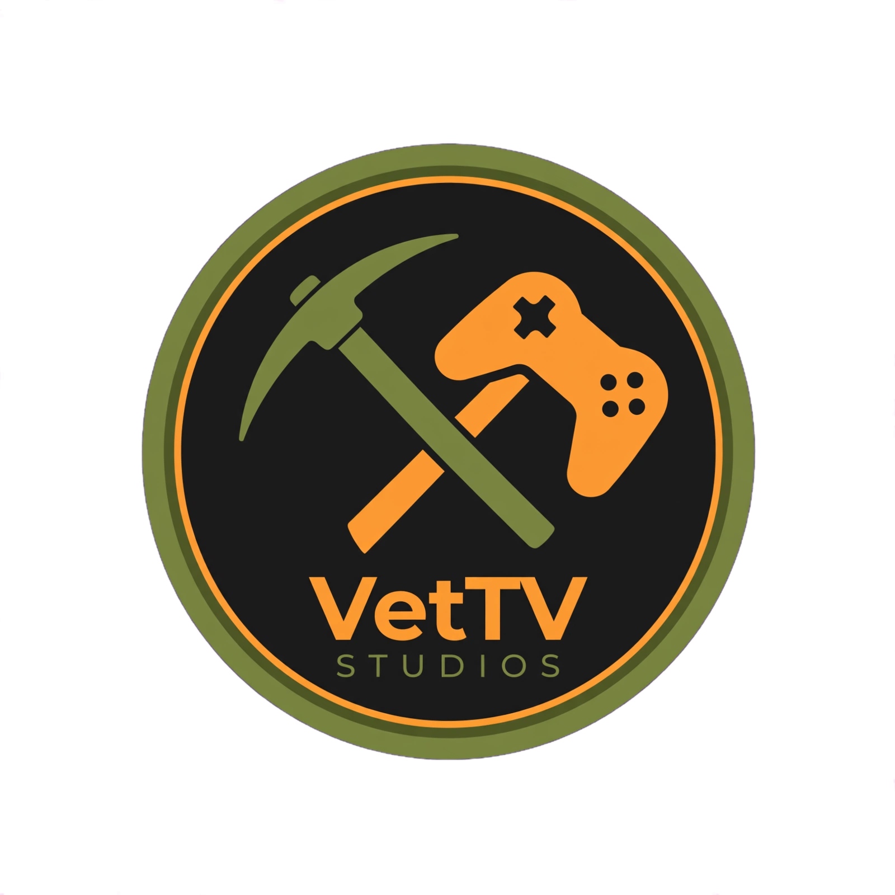
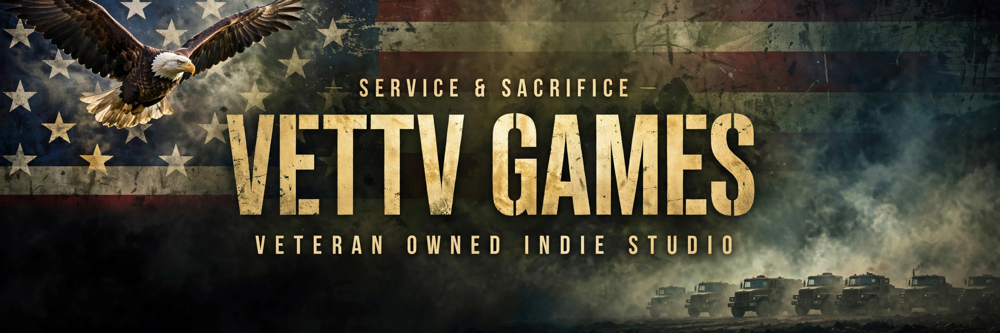

<div align="center">  <br/> <h1>VetTV Studios</h1> <sub>Veteran Owned Indie Studio • Service & Sacrifice</sub> </div>

<div align="center">



**Crafting nostalgic tycoon games & stream tools.**

[](https://github.com/VetTV-Studios)
[](https://www.python.org/)
[](#-lemonade-tycoon)

90% wild game dev logs 🎬 • 10% pure nonsense 🎮 • 100% Service & Sacrifice 🇺🇸

</div>

---

### 🎮 What We Build

**VetTV Studios** is a veteran-owned indie studio focused on bringing back the tycoon games we grew up with — with a modern twist.

- **Nostalgic Tycoon Games** — Lemonade stands, arcades, and more
- **Stream Tools** — Tools for creators, by a creator (VetTV | Gaming & Stream Clips)
- **No Algorithm BS** — Just fun games that respect your time

### 🍋 Lemonade Tycoon — In Certification on Microsoft Store

Our first title is currently **In Certification on the Microsoft Store**.

> Run your stand, upgrade your gear, battle the weather, and build a lemonade empire. Built from scratch with love, chaos, and a lot of coffee.

More details + trailer coming soon to this org.

### 🛠️ Tech Stack

We build fast, ship fast, break things (then fix them on stream).

```yaml
Language: Python
UI: webui + webview
Platform: Windows / Microsoft Store (more to come)
Workflow: Python + webui-dev + pure veteran grit
```

- Python for core game logic
- webui-dev for lightweight, native-feeling UIs
- GitHub for version control and public logs

### 🇺🇸 Veteran Owned

Service & Sacrifice isn't just a tagline. It's how we build.

VetTV Studios is **100% veteran-owned and operated** out of Tama, IA. We bring the same discipline from service into game dev — and we document all of it, wins and fails.

### 📫 Connect With Us

We post wild dev logs daily. Come watch us build in public.

- **Bluesky:** [@vettvx.bsky.social](https://bsky.app/profile/vettvx.bsky.social)
- **Threads:** [@vet_tv_](https://www.threads.com/@vet_tv_)
- **Twitch:** [vet_tv_](https://www.twitch.tv/vet_tv_)
- **Pickax (algo-free):** [Join us on Pickax](https://pickax.com/?referralCode=2e196iw&refSource=copy)
- **Mastodon:** `#IndieGameDev` `#VeteranOwned` `#Python`
- **Email:** vetgaming1982@outlook.com
- **Privacy:** [vettv-privacy](https://vet-tv.github.io/vettv-privacy/)

### 🚀 Current Status

- [x] VetTV Studios org created
- [x] Lemonade Tycoon — Built
- [ ] Lemonade Tycoon — Microsoft Store Certified
- [ ] Public Dev Logs Repo
- [ ] Next Tycoon Prototype

---

<div align="center">

**Built with Python. Fueled by service.**

*If you like nostalgic tycoon games, veteran-owned businesses, and unfiltered game dev — star this org and follow along.*

**VetTV Studios © 2026 — Tama, Iowa**

</div>
